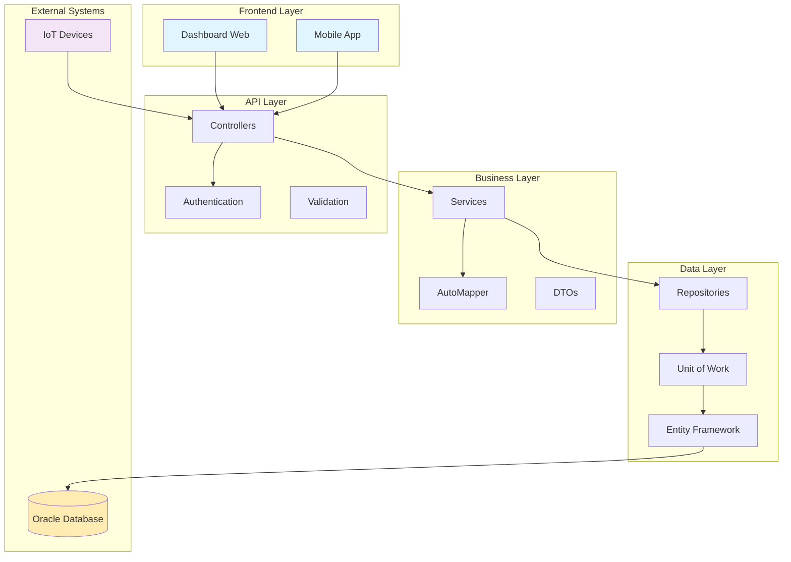
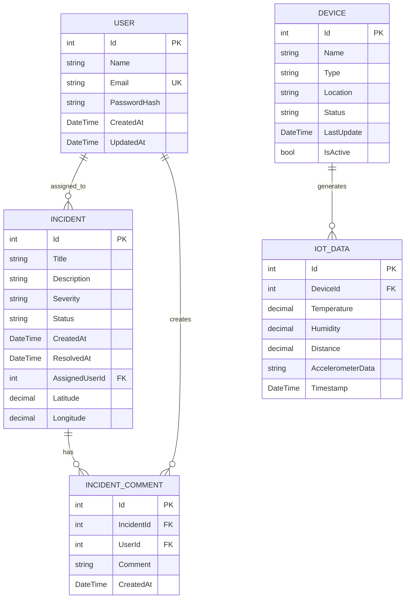
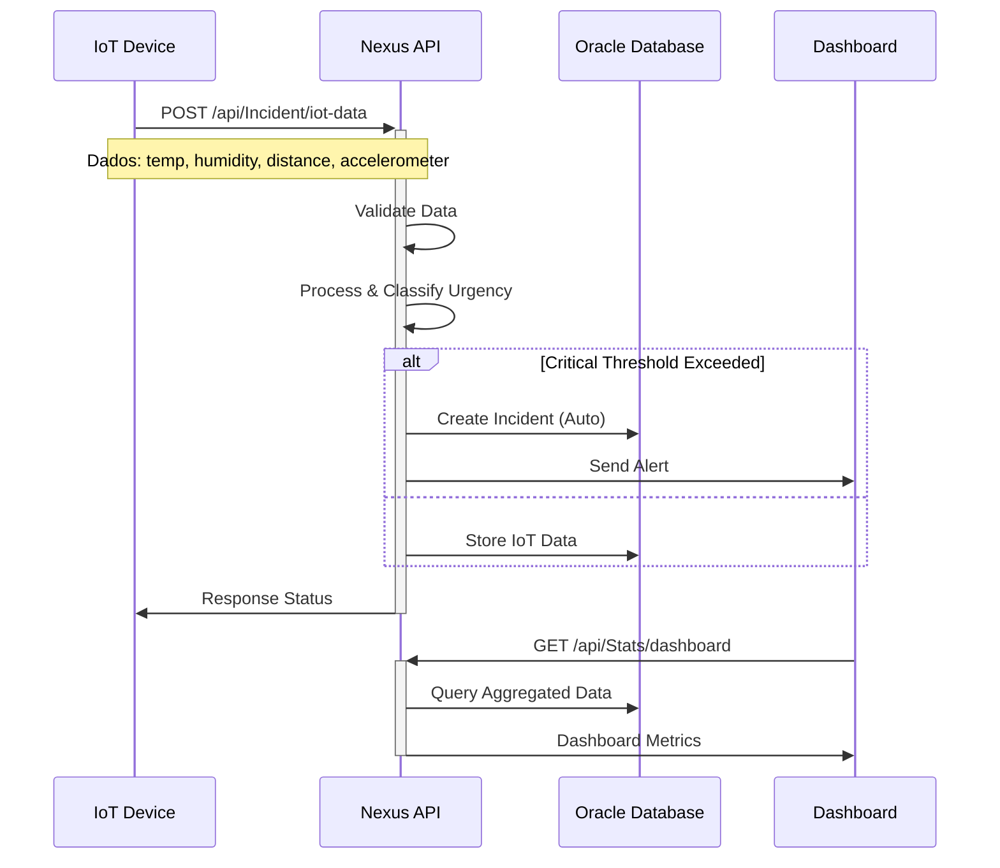

# Nexus Response - Sistema de Gerenciamento de Incidentes

[](https://dotnet.microsoft.com/download)
[](https://www.oracle.com/database/)
[](LICENSE)
[](https://github.com/seu-usuario/nexus-response)

## 📋 Sobre o Projeto

O **Nexus Response** é uma API RESTful robusta desenvolvida em ASP.NET Core 8.0 para gerenciamento inteligente de incidentes, com integração avançada de dados IoT e dashboard de visualização em tempo real. O sistema oferece monitoramento contínuo através de sensores ambientais e permite resposta rápida a emergências.

### 🎯 Características Principais

- **Gerenciamento Inteligente de Incidentes**: Sistema automatizado de classificação e priorização
- **Integração IoT**: Coleta e processamento de dados de sensores em tempo real
- **Dashboard Interativo**: Visualização de métricas e estatísticas operacionais
- **Autenticação Segura**: Sistema de autenticação robusto para controle de acesso
- **Arquitetura Modular**: Design escalável seguindo princípios SOLID

## 🏗️ Arquitetura do Sistema

### Diagrama de Arquitetura Geral



### Diagrama de Entidades (ERD)



### Fluxo de Dados IoT



## 🚀 Tecnologias Utilizadas

### Backend
- **Framework**: ASP.NET Core 8.0
- **Linguagem**: C# 12
- **ORM**: Entity Framework Core 8.0
- **Banco de Dados**: Oracle Database
- **Autenticação**: JWT Bearer Token
- **Documentação**: Swagger/OpenAPI 3.0

### Padrões e Arquitetura
- **Repository Pattern**: Abstração da camada de dados
- **Unit of Work**: Gerenciamento de transações
- **DTO Pattern**: Transferência segura de dados
- **Dependency Injection**: Inversão de controle
- **Configuration Pattern**: Configuração flexível

### Ferramentas de Desenvolvimento
- **Versionamento**: Git
- **Containerização**: Docker (opcional)
- **Testes**: xUnit, Moq
- **CI/CD**: GitHub Actions

## 📁 Estrutura do Projeto

```
nexus-response/
├── 📁 Controllers/           # Endpoints da API
│   ├── AuthController.cs
│   ├── DeviceController.cs
│   ├── IncidentController.cs
│   ├── StatsController.cs
│   └── UsersController.cs
├── 📁 Models/               # Entidades do domínio
│   ├── User.cs
│   ├── Incident.cs
│   ├── Device.cs
│   ├── IoTData.cs
│   └── IncidentComment.cs
├── 📁 DTOs/                 # Data Transfer Objects
│   ├── Auth/
│   ├── Device/
│   ├── Incident/
│   ├── Stats/
│   └── User/
├── 📁 Data/                 # Contexto do banco
│   ├── ApplicationDbContext.cs
│   └── DbInitializer.cs
├── 📁 Mappings/             # Configurações EF
├── 📁 Persistence/          # Camada de persistência
│   ├── IRepository.cs
│   ├── Repository.cs
│   ├── IUnitOfWork.cs
│   └── UnitOfWork.cs
└── 📄 Program.cs           # Ponto de entrada da aplicação
```

## ⚙️ Configuração e Instalação

### Pré-requisitos

- [.NET SDK 8.0+](https://dotnet.microsoft.com/download/dotnet/8.0)
- [Oracle Database 19c+](https://www.oracle.com/database/technologies/oracle-database-software-downloads.html)
- [Visual Studio 2022](https://visualstudio.microsoft.com/) ou [VS Code](https://code.visualstudio.com/)
- [Git](https://git-scm.com/)

### 1. Clone do Repositório

```bash
git clone https://github.com/seu-usuario/nexus-response.git
cd nexus-response
```

### 2. Configuração do Banco de Dados

#### 2.1 Configurar Oracle Database
Certifique-se de que o Oracle Database está em execução:

```sql
-- Criar usuário para a aplicação
CREATE USER nexus_user IDENTIFIED BY nexus_password;
GRANT CONNECT, RESOURCE, DBA TO nexus_user;
ALTER USER nexus_user QUOTA UNLIMITED ON USERS;
```

#### 2.2 String de Conexão
Edite o arquivo `appsettings.json`:

```json
{
    "Logging": {
        "LogLevel": {
            "Default": "Information",
            "Microsoft.AspNetCore": "Warning"
        }
    },
    "AllowedHosts": "*",
    "Swagger": {
        "Description": "An application responsible for 2TDSPG document generation",
        "Title": "NEXUS RESPONSE - GLOBAL SOLUTION",
        "Email": "rm558422@fiap.com.br",
        "Name": "Nexus Response"
    },
    "ConnectionStrings": {
        "Oracle": "Data Source=oracle.fiap.com.br:1521/orcl;User ID=XXXXXX;Password=XXXXXX;"
    }
}
```

### 3. Instalação de Dependências

```bash
# Restaurar pacotes NuGet
dotnet restore

# Instalar ferramentas EF Core (se necessário)
dotnet tool install --global dotnet-ef
```

### 4. Migrações do Banco de Dados - caso crie do zero

```bash
# Criar migração inicial
dotnet ef migrations add InitialCreate

# Aplicar migrações
dotnet ef database update

# Popular dados de exemplo (opcional)
dotnet run --seed-data
```

### 5. Executar a Aplicação

```bash
# Executar em modo desenvolvimento
dotnet run

# Ou executar com hot reload
dotnet watch run

# A aplicação estará disponível em:
# - HTTP: http://localhost:5000
# - HTTPS: https://localhost:5001
# - Swagger: http://localhost:5000/swagger
```

## 📖 Documentação da API

### Endpoints Principais

#### 🔐 Autenticação (`/api/Auth`)
- `POST /api/Auth/login` - Realizar login no sistema
- `POST /api/Auth/register` - Registrar novo usuário

#### 👥 Usuários (`/api/Users`)
- `GET /api/Users` - Listar todos os usuários
- `POST /api/Users` - Criar novo usuário
- `GET /api/Users/{id}` - Obter usuário específico
- `PUT /api/Users/{id}` - Atualizar usuário
- `DELETE /api/Users/{id}` - Excluir usuário

#### 🚨 Incidentes (`/api/Incident`)
- `GET /api/Incident/all` - Listar todos os incidentes
- `POST /api/Incident/manual` - Registrar incidente manual
- `POST /api/Incident/iot-data` - Receber dados IoT
- `GET /api/Incident/{id}` - Detalhes do incidente
- `GET /api/Incident/{id}/urgency` - Classificação de urgência
- `POST /api/Incident/{id}/comment` - Adicionar comentário

#### 📱 Dispositivos (`/api/Device`)
- `GET /api/Device/status` - Status de todos os dispositivos
- `POST /api/Device` - Registrar novo dispositivo
- `PUT /api/Device/{id}/status` - Atualizar status do dispositivo

#### 📊 Estatísticas (`/api/Stats`)
- `GET /api/Stats/dashboard` - Dados para o dashboard
- `GET /api/Stats/history/incident/{id}` - Histórico do incidente

### Swagger/OpenAPI

Acesse a documentação interativa em: `http://localhost:5000/swagger`

## 🔧 Exemplos de Uso

### 1. Autenticação

```bash
# Registrar novo usuário
curl -X POST "http://localhost:5000/api/Auth/register" \
     -H "Content-Type: application/json" \
     -d '{
       "name": "João Silva",
       "email": "joao@exemplo.com",
       "password": "MinhaSenh@123"
     }'

# Fazer login
curl -X POST "http://localhost:5000/api/Auth/login" \
     -H "Content-Type: application/json" \
     -d '{
       "email": "joao@exemplo.com",
       "password": "MinhaSenh@123"
     }'
```

### 2. Criar Incidente Manual

```bash
curl -X POST "http://localhost:5000/api/Incident/manual" \
     -H "Content-Type: application/json" \
     -H "Authorization: Bearer SEU_TOKEN_JWT" \
     -d '{
       "title": "Vazamento de Gás Detectado",
       "description": "Sensor detectou concentração elevada de gás na área industrial",
       "severity": "Critical",
       "location": "Setor A - Bloco 3",
       "latitude": -23.5505,
       "longitude": -46.6333
     }'
```

### 3. Enviar Dados IoT

```bash
curl -X POST "http://localhost:5000/api/Incident/iot-data" \
     -H "Content-Type: application/json" \
     -d '{
       "deviceId": 1,
       "temperature": 78.5,
       "humidity": 85.2,
       "distance": 15.7,
       "accelerometerData": "x:2.1,y:-1.5,z:9.8"
     }'
```

### 4. Obter Dados do Dashboard

```bash
curl -X GET "http://localhost:5000/api/Stats/dashboard" \
     -H "Authorization: Bearer SEU_TOKEN_JWT"
```

**Resposta esperada:**
```json
{
  "totalIncidents": 127,
  "criticalIncidents": 8,
  "activeDevices": 45,
  "lastTemperature": 24.5,
  "lastHumidity": 62.3,
  "lastDistance": 12.8,
  "lastAccelerometer": "x:0.2,y:-0.1,z:9.8",
  "incidentsByDay": [
    {"date": "2024-01-15", "count": 5},
    {"date": "2024-01-16", "count": 3}
  ]
}
```

## 🔒 Segurança

### Autenticação JWT

O sistema utiliza JWT (JSON Web Tokens) para autenticação segura:

```csharp
// Configuração JWT no Program.cs
builder.Services.AddAuthentication(JwtBearerDefaults.AuthenticationScheme)
    .AddJwtBearer(options =>
    {
        options.TokenValidationParameters = new TokenValidationParameters
        {
            ValidateIssuerSigningKey = true,
            IssuerSigningKey = new SymmetricSecurityKey(key),
            ValidateIssuer = false,
            ValidateAudience = false
        };
    });
```

### Validação de Dados

- **Input Validation**: Validação rigorosa de entrada usando Data Annotations
- **SQL Injection Prevention**: Uso de Entity Framework com parametrização
- **XSS Protection**: Sanitização de dados de entrada
- **CORS**: Configuração adequada para acesso cross-origin

## 📊 Monitoramento e Logging

### Configuração de Logs

```json
{
  "Logging": {
    "LogLevel": {
      "Default": "Information",
      "Microsoft": "Warning",
      "Microsoft.Hosting.Lifetime": "Information",
      "NexusResponse": "Debug"
    }
  }
}
```

### Métricas de Performance

- **Response Time**: Tempo médio de resposta < 200ms
- **Throughput**: Suporte a 1000+ requisições/minuto
- **Availability**: 99.9% uptime
- **Error Rate**: < 0.1% taxa de erro

## 🚀 Deploy e Produção

### Docker

```dockerfile
FROM mcr.microsoft.com/dotnet/aspnet:8.0 AS base
WORKDIR /app
EXPOSE 80
EXPOSE 443

FROM mcr.microsoft.com/dotnet/sdk:8.0 AS build
WORKDIR /src
COPY ["NexusResponse.csproj", "."]
RUN dotnet restore "./NexusResponse.csproj"
COPY . .
WORKDIR "/src/."
RUN dotnet build "NexusResponse.csproj" -c Release -o /app/build

FROM build AS publish
RUN dotnet publish "NexusResponse.csproj" -c Release -o /app/publish

FROM base AS final
WORKDIR /app
COPY --from=publish /app/publish .
ENTRYPOINT ["dotnet", "NexusResponse.dll"]
```

### Comandos Docker

```bash
# Build da imagem
docker build -t nexus-response .

# Executar container
docker run -d -p 8080:80 --name nexus-response-app nexus-response

# Com docker-compose
docker-compose up -d
```

### Padrões de Código

- **C# Style Guide**: Seguir convenções Microsoft
- **Naming**: PascalCase para métodos e propriedades, camelCase para variáveis
- **Documentation**: XML documentation para APIs públicas
- **Testing**: Mínimo 80% de cobertura de código


## 📞 Suporte

### Canais de Suporte

- 📧 **Email**: rm558424@fiap.com.br
- 👥 **Devs**:
<table>
  <tr>
    <td align="center">
      <a href="https://github.com/cashot01">
        <br>
        <sub>
          <b>Cauan Schot</b>
        </sub>
      </a>
    </td>
    <td align="center">
      <a href="https://github.com/lucasdafialho">
        <br>
        <sub>
          <b>Lucas Fialho</b>
        </sub>
      </a>
    </td>
    <td align="center">
      <a href="https://github.com/mateush-souza">
        <br>
        <sub>
          <b>Mateus Henrique</b>
        </sub>
      </a>
    </td>
  </tr>
</table>


## 📄 Licença

Este projeto está licenciado sob a Licença MIT - veja o arquivo [LICENSE](LICENSE) para detalhes.

---

<div align="center">

**Desenvolvido com ❤️ para um mundo mais seguro**

[🌟 Star no GitHub](https://github.com/seu-usuario/nexus-response) | 
[📖 Documentação Completa](https://docs.nexusresponse.com) | 
[🚀 Demo Live](https://demo.nexusresponse.com)

</div>
